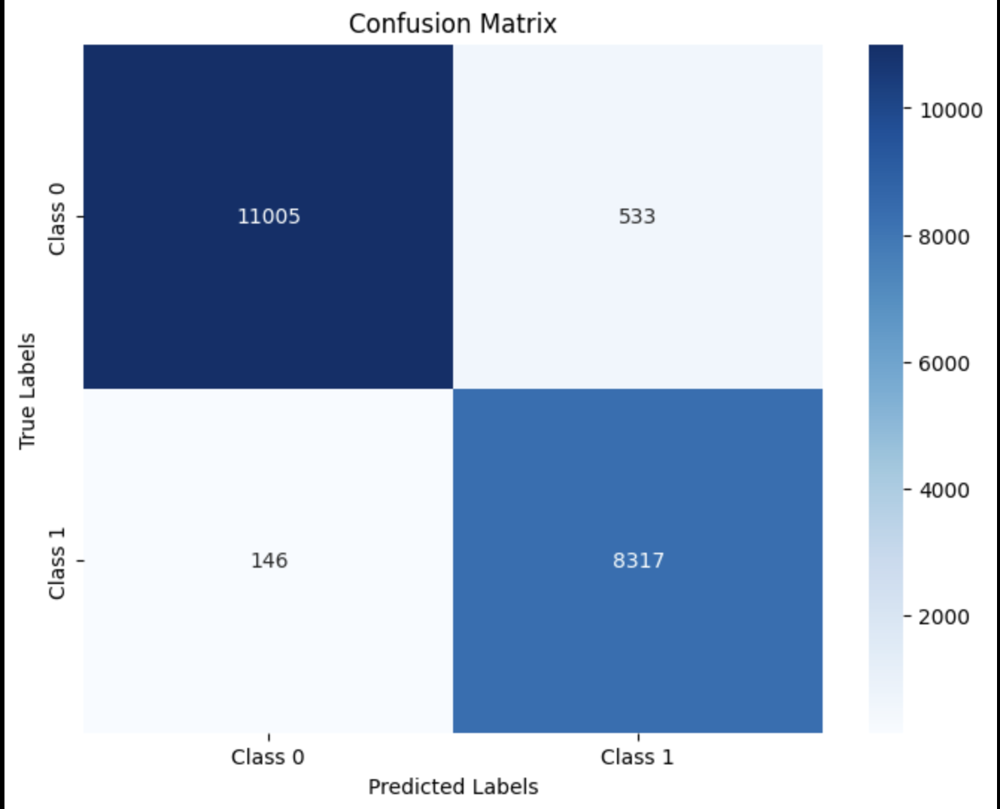

# Pixel Persona

The problem statement for this assignment is to build a Deep Learning Model that can detect gender of a person from an image.

## Dataset

In order to train the model, a dataset provided on Kaggle by Yasser Hessein, titled "Gender Dataset" was used. It is a collection designed for gender classification tasks. It includes two classes: male and female. The training directory provides 23,000 photos of each class, whereas the validation directory has 5,500 images of each class.

The dataset can be found [here](https://www.kaggle.com/datasets/yasserhessein/gender-dataset).

## Approach

The sequenctial model was built using tensorflow and keras. The architecture of the model is as follows:

- The first layer is a Conv2D layer with 32 filters and  ReLU activation.
- Followed by a MaxPooling2D layer with a pool size of 2x2.
- The second Conv2D layer has 64 filters and ReLU activation.
- Finally, a Dense layer with a single unit and sigmoid activation is used for binary classification.

## Results

The model was trained for 3 epochs and achieved an accuracy of 0.96 on the test set. The confusion matrix is 



## Live Model and Demo

The code for the live model is present in the `live.py` file. The model can be run using the following command:

```bash
python live.py
```

The model will open a webcam and detect the gender of the faces processed using Haar Cascade.

A video demo of the model can be found [here](recording_live_detection.mov).